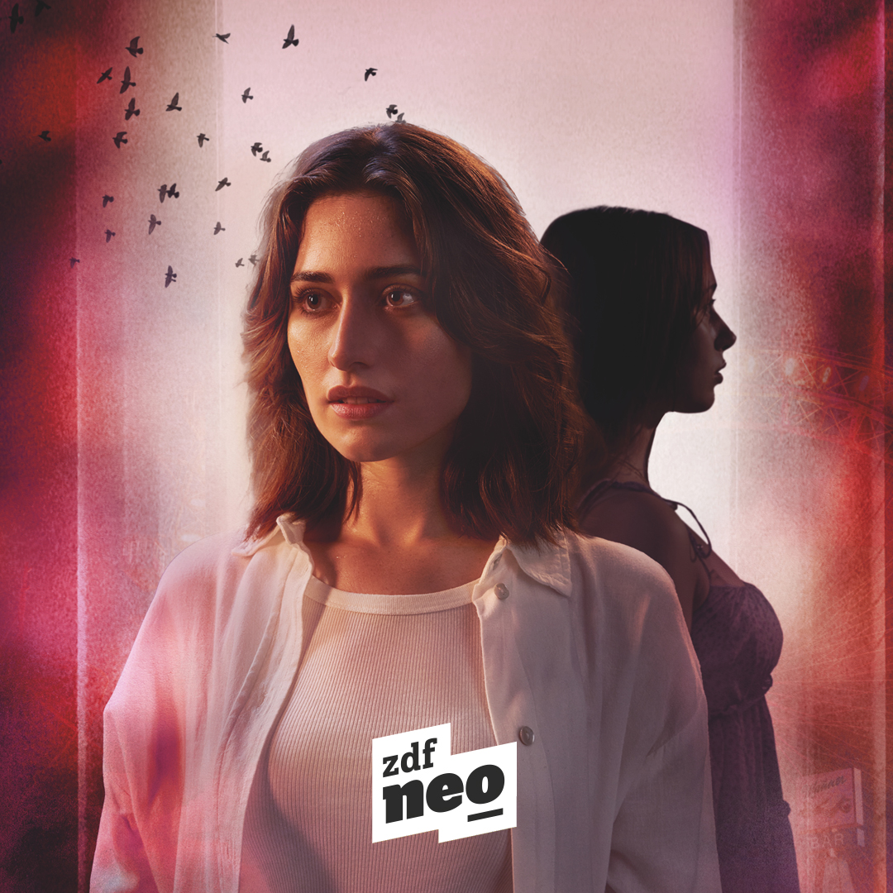

# Latest News

**FCP Cafe is a technical community for professional Final Cut Pro editors.**

---

==- :icon-bookmark: Make FCP Cafe your Home Page
+++ Safari
1. In the top left corner of your screen, select **Safari** and then **Preferences** and then **General**.
2. Next to **New windows open with** and **New tabs open with**, select **Homepage**.
3. Next to **Homepage** enter: `https://fcp.cafe`.
+++ Chrome
1. In the top right corner of your computer's browser, click **More** icon and then **Settings**.
2. Under **Appearance**, turn on **Show home button**.
3. Select your current homepage, then, enter: `https://fcp.cafe`.
+++ Firefox
1. Drag this tab to the **Home** button, then release.
2. Click **Yes**.
+++ Microsoft Edge
1. In the upper right corner of your browser, select the **More** icon and then **Settings**.
2. Under **Set your homepage**, click the Down arrow and then **A specific page or pages**.
3. If you have a current homepage: Next to the URL, click **X**.
4. Click **Enter a URL**. Then, type: `https://fcp.cafe`.
+++ Internet Explorer
1. In the menu bar on the top of your browser, click **Tools**.
2. Select **Internet Options**.
3. Click the **General** tab.
4. Under "Home page," enter: `https://fcp.cafe`.
5. Click OK.
6. Restart your browser.
+++
===

[!button variant="warning" target="blank" text="Get the Latest News via our RSS Feed"](https://fcp.cafe/rss.xml){target="_blank"}

---

!!!
Want to contribute or advertise? [Learn more here!](https://fcp.cafe/contribute/){target="_blank"}
!!!

---

### Friday 2nd June 2023

**Der Schatten** (The Shadow) is streaming tomorrow on German public broadcaster [ZDFneo](https://www.zdf.de/serien/der-schatten/trailer-staffel-1-104.html){target="_blank"}.

It's a **6 x 45min mystery** series cut in Final Cut Pro, based on a novel by **Melanie Raabe**.

_The journalist Norah (Deleila Piasko / Transatlantic) moves from Berlin to Vienna to start a new life and job at a young & arty magazine. As soon as she arrives, a homeless woman foretells her that she will kill a man named Arthur Grimm six weeks later. Norah tries to ignore the incident - until strange things happen._

#### Trailer

You can watch the trailer [here](https://www.zdf.de/serien/der-schatten/trailer-staffel-1-104.html){target="_blank"}.

#### Fun Stats

- 3 Film Editors (Florian Duffe, Silke Botsch & Martin Wunschick)
- 1 Assistant Editor
- 174 shifts of editing
- 89 hours of footage
- 3946 Video Clips
- 3500 Audio Clips

#### Tools Used

- [Sync-N-Link](https://fcp.cafe/tools/#sync-n-link-x){target="_blank"}
- [CommandPost](https://fcp.cafe/tools/#commandpost){target="_blank"} - using **Titles to Keywords** for line-by-lines
- [PostLab](https://fcp.cafe/tools/#postlab){target="_blank"}
- [X2Pro](https://fcp.cafe/tools/#x2pro){target="_blank"}
- [Producers Best Friend](https://fcp.cafe/tools/#producers-best-friend){target="_blank"}

#### Screenshots

#### Poster

---

**Ulti.media** has released a new **Transcriber** Promo on YouTube. Chris at LateNite has been beta testing, and it's awesome.

{target="_blank"}

You can learn more [here](https://ulti.media/transcriber/).

[!button text="Discuss today's news" target="blank" variant="info"](https://github.com/CommandPost/FCPCafe/discussions)

---

### Thursday 1st June 2023

**Alteon.io** has announced that **Brian Meaney** will now be their new Head of Product. He brings more than two decades of experience from Apple and Magic Leap. Brian will direct product development and UX for their entire ecosystem.

This is very exciting for Final Cut Pro users - as Alteon is very committed to the Final Cut Pro ecosystem! You can learn more [here](https://www.accesswire.com/viewarticle.aspx?id=758114).

[!button text="Discuss today's news" target="blank" variant="info"](https://github.com/CommandPost/FCPCafe/discussions)

---

!!!info Sponsored
_Tight. Terse. Terrific. Bim. Bam. Boom._ – Cut/daily reader 
Post Production insight delivered to your inbox. 
Sign up for **free** at [Cut/daily.com](https://www.cut-daily.com){target="_blank"}
!!!

---

### Wednesday 31st May 2023

**Colourlab Ai** is having a Spring Flash Sale! Up to 50% Off on Our Color Grading Software - Only 48 Hours Left!

Spring is in the air, and so are the savings!

Here's what's on offer:

**Colourlab Ai Studio Annual License:** Get a whopping 50% off on their Colourlab Ai Studio Annual License. This brings the cost of Colourlab Ai, Look Designer Plugin, and Grainlab Plugin down to just $249. That's less than the cost of a single plugin! Considering the combined value of all three applications is over $1000, this is a massive saving. Use the code `springstudio50` to take advantage of this offer.
**Look Designer Perpetual Licenses:** Colourlab Ai is offering a 30% discount on their Look Designer Perpetual Licenses. This means you can own Look Designer forever for just $349. Look Designer 3.0 for Davinci and Premiere runs on both Mac and PC and is the perfect companion for creating X01 files, Look Design, Look Testing, EL Zones, and Full Color Management. Use the code `springlook30` to avail this offer.

Buy Colourlab Ai Studio [here](https://colourlab.ai/colourlab-ai-studio-2-yearly/){target="_blank"}.

Buy Look Designer Perpetual [here](https://colourlab.ai/look-designer-resolve-perpetual/){target="_blank"}.

---

A new batch of nOb controllers is now available! You can order [here](https://order.nobcontrol.com){target="_blank"}.

[!button text="Discuss today's news" target="blank" variant="info"](https://github.com/CommandPost/FCPCafe/discussions)

---

!!!info Sponsored
Use [Transfer Toolbox](https://transfertoolbox.io){target="_blank"} to get from Final Cut Pro for Mac to iPad!
!!!

---

### Tuesday 30th May 2023

We're currently experimenting with adding Discussions & Reactions to the bottom of every page at FCP Cafe - that tie into GitHub Discussions. You'll need a free GitHub account to comment and react.

We're still working on the formatting - they're currently a bit "buggy" in terms of automatically resizing, and sometimes require a hard page reset to appear properly. We're investigating a proper fix - stay tuned.

---

**Recall Toolbox** is now available for early beta testing on [TestFlight](https://recalltoolbox.io){target="_blank"}.

Recall Toolbox is a Final Cut Pro Workflow Extension that acts as a Shared Pasteboard.

Anything that you can copy and paste in Final Cut Pro, Recall Toolbox can store.

---

Chris at [LateNite](https://latenitefilms.com/technology/){target="_blank"} has decided to put the Final Cut Pro & DaVinci Resolve Communities literally head-to-head by introducing [Resolve Cafe](https://resolve.cafe){target="_blank"}. Let's see which community is more proactive in sharing awesome content!

---

**MotionVFX** is having a [50% Flash Sale](https://www.motionvfx.com/store){target="_blank"} on selected products.

They've also released a nice new package called [mProduct](https://www.motionvfx.com/store,mproduct,p3977.html){target="_blank"}.

---

**AudioSwift 2.3.5 Beta** with 14-bit MIDI CC is [now available](https://audioswiftapp.com/try-out-these-new-features-in-beta/){target="_blank"}.

AudioSwift for macOS transforms your trackpad into a set of MIDI tools like sliders, triggers, XY pads, mixing controllers and MPE. With support for MacBooks and Magic Trackpads, the app runs in the top menu bar waiting to be called. Tap the trackpad with a four fingers tap gesture to activate and a console window appears showing the current controller mode. You can then start sending MIDI with simple touch gestures and when you finish, press the Esc key to turn AudioSwift off. It’s the perfect compact MIDI controller for the mobile or desktop producer.

AudioSwift works great in companion with [CommandPost](https://commandpost.io){target="_blank"} via MIDI for [controlling Final Cut Pro](https://audioswiftapp.com/fcp/){target="_blank"}.

[!button text="Discuss today's news" target="blank" variant="info"](https://github.com/CommandPost/FCPCafe/discussions)

---

!!!info Sponsored
[Recall Toolbox](https://recalltoolbox.io){target="_blank"} is now available on TestFlight as an early beta!
!!!

---

### Monday 29th May 2023

**Color Finale 2.6.6** has been released to fix support for Final Cut Pro 10.6.6.

Only install Color Finale 2.6.6 after updating to Final Cut Pro 10.6.6. The plugin won’t work otherwise.

If you are on Color Finale 2.6.5, update by launching ColorFinale.app and navigating to **ColorFinale > Check For Updates…** in the menu bar.

You can learn more on their [website](https://colorfinale.com){target="_blank"}.

---

Chris at [LateNite](https://latenitefilms.com/technology/){target="_blank"} has updated the pricing for [BRAW Toolbox](https://brawtoolbox.io){target="_blank"}, [Gyroflow Toolbox](https://gyroflowtoolbox.io){target="_blank"} & [Marker Toolbox](https://markertoolbox.io){target="_blank"}.

- **[BRAW Toolbox](https://brawtoolbox.io){target="_blank"}** is now **79.99** in your local currency (i.e. **AUD79.99**, **USD79.99**, **CAD79.99**).
- **[Marker Toolbox](https://markertoolbox.io){target="_blank"}** is now **19.99** in your local currency (i.e. **AUD19.99**, **USD19.99**, **CAD19.99**).
- **[Gyroflow Toolbox](https://gyroflowtoolbox.io){target="_blank"}** is now **4.99** in your local currency (i.e. **AUD4.99**, **USD4.99**, **CAD4.99**).

Their upcoming apps will have the same pricing model:

- **[Recall Toolbox](https://recalltoolbox.io){target="_blank"}** is now **29.99** in your local currency (i.e. **AUD29.99**, **USD29.99**, **CAD29.99**).
- **[Transfer Toolbox](https://transfertoolbox.io){target="_blank"}** is now **4.99** in your local currency (i.e. **AUD4.99**, **USD4.99**, **CAD4.99**).

However, for example, if your country doesn't have an equivalent of 4.99 (i.e. Rp89,000 in Indonesia), it will default to a USD$4.99 equivalent.

Transfer Toolbox is currently waiting for approval on the Mac App Store, but you can download from TestFlight.

Recall Toolbox is currently on TestFlight, and will hopefully be submitted to the Mac App Store by the end of this week for review.

[!button text="Discuss today's news" target="blank" variant="info"](https://github.com/CommandPost/FCPCafe/discussions)

---

### Sunday 28th May 2023

We've recently reported two annoying **Final Cut Pro 10.6.6 bugs** to be across:

- [FCPXML v1.11 doesn't support Soundtracks (May 28, 2023)](https://github.com/CommandPost/FCPCafe/issues/94){target="_blank"}
- [Audio Presets don't migrate from earlier versions to v10.6.6 (May 27, 2023)](https://github.com/CommandPost/FCPCafe/issues/92){target="_blank"}

We've reported them to Apple, and will keep track of them in our [Bug Tracker](https://fcp.cafe/bugtracker/).

[!button text="Discuss today's news" target="blank" variant="info"](https://github.com/CommandPost/FCPCafe/discussions)

---

### Saturday 27th May 2023

Hedge are on the lookout for passionate beta users to help shape the future of Hedge products (like [Hedge](https://hedge.video/hedge){target="_blank"}, [PostLab](https://hedge.video/postlab/benefits){target="_blank"} & [EditReady](https://hedge.video/editready){target="_blank"}). If you think you have what it takes and would like to join, sign up [here](http://bit.ly/HedgeBetaProgram){target="_blank"}.

{target="_blank"}

[!button text="Discuss today's news" target="blank" variant="info"](https://github.com/CommandPost/FCPCafe/discussions)

---

### Friday 26th May 2023

**Turn of the Tide** premieres today on Netflix. Fully edited in Final Cut Pro.

Created by Augusto de Fraga. Edited by Marcos Castiel (Ep's 1, 2, 5 & 7) and Pedro Ribeiro (Ep's 3, 4 & 6).

!!!
We will be adding an extensive case study [here](https://fcp.cafe/casestudies/turnofthetide/) soon!
!!!

{target="_blank"}

---

**Blood & Gold** premieres today on Netflix. Fully edited in Final Cut Pro.

Edited by Knut Hake.

{target="_blank"}

---

**Sex O'Clock** premieres today in Czechia. Episodes 3, 6, 9 and 10 was cut in Final Cut Pro by [Jiří Fiala](https://jirifiala.cz) (the other episodes were cut in Adobe Premiere).

FCPXMLs were sent to DaVinci Resolve for colour grading and X2Pro was used to send AAFs to ProTools for mixing. The sound designer was very impressed with the neatness of the timeline.

{target="_blank"}

---

Everyone's talking about **Final Cut Pro for iPad**.

Here's a collection of some of the great Final Cut Pro (for iPad) YouTube videos:

- [Ripple Training - Final Cut Pro for iPad Getting Started (39mins)](https://www.youtube.com/watch?v=XvMDC9V3-Rs){target="_blank"}
- [iJustine - Final Cut Pro on iPad Review - Forget everything you know about editing (13mins)](https://www.youtube.com/watch?v=MjRouMY7bgU){target="_blank"}
- [Dylan Bates - The Complete Guide to Final Cut Pro on iPad (53mins)](https://www.youtube.com/watch?v=iLXnuoEPheQ){target="_blank"}
- [Tyler Stalman - Final Cut Pro for iPad: Guide & Review (16mins)](https://www.youtube.com/watch?v=eKG_T9GumVM){target="_blank"}
- [PetaPixel - Final Cut Pro for iPad Review: It FINALLY Happened! (12mins)](https://www.youtube.com/watch?v=cacbcjvlFRg){target="_blank"}
- [Six Colors - Hands on with Final Cut Pro for iPad (32mins)](https://www.youtube.com/watch?v=VpwUN5o_3mo){target="_blank"}
- [The Verge - Final Cut Pro for iPad review: still rendering (10mins)](https://www.youtube.com/watch?v=r4QCQ7qGsL4){target="_blank"}

Chris at [LateNite](https://latenitefilms.com) has also announced [Transfer Toolbox](https://transfertoolbox.io){target="_blank"} on [Twitter](https://twitter.com/chrisatlatenite/status/1661610054292758529){target="_blank"}, allowing you to convert Final Cut Pro (for Mac) libraries into Final Cut Pro (for iPad) projects.

He also discovered that Final Cut Pro (for iPad) [can actually read files from an external SSD](https://twitter.com/chrisatlatenite/status/1661697912202743809){target="_blank"}.

[!button text="Discuss today's news" target="blank" variant="info"](https://github.com/CommandPost/FCPCafe/discussions)

---

### Tuesday 23rd May 2023

Iain Anderson has written a very detailed [Final Cut Pro 10.6.6 blog post](https://www.provideocoalition.com/final-cut-pro-10-6-6-for-mac/){target="_blank"} over at Pro Video Coalition.

[!button text="Discuss today's news" target="blank" variant="info"](https://github.com/CommandPost/FCPCafe/discussions)

---

!!!
Want to contribute or advertise? [Learn more here!](https://fcp.cafe/contribute/)
!!!

---

{{ include "giscus.md" }}