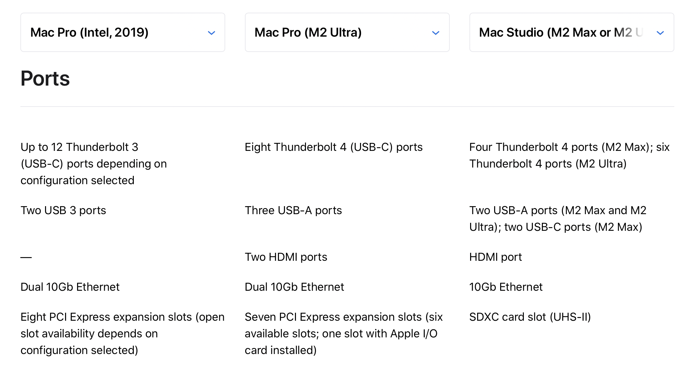
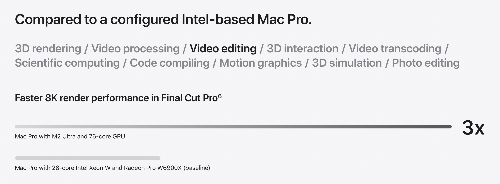

{{ include "latest-news-logo.md" }}

# Latest News

**FCP Cafe is a technical community for professional Final Cut Pro editors.**

{{ include "homepage.md" }}

{{ include "rss-buttons.md" }}

---

### Wednesday 7th June 2023

**To My Father** is a Short Documentary Film edited in Final Cut Pro that premieres this week at the Tribeca Film Festival in New York City.

The movie depicts Deaf actor Troy Kotsur's journey to winning an Oscar and his father's inspiring influence on him, despite a tragic accident.

Troy previously won the Best Supporting Actor Oscar for his role in Apple TV’s **CODA**.

**Josh Meyers**, the film’s editor, had previously presented this project as a work in progress as part of his Keynote Presentation at the 2022 FCPX Summit in Austin, Texas.

Josh and the team at Emergent Order Foundation has truly enjoyed collaborating with Troy and hope people can come out to support the film if you’re in town!

#### Screening

**To My Father** will be screening 4 times at the festival as part of the Shorts program.

> Thursday June 8th @ 8:15pm 
> Friday June 9th @ 2:30pm 
> Wednesday June 14th @ 6:00pm 
> Saturday June 17th @ 3:30pm

There's more information on the [Tribeca Schedule and Tickets Page](https://tribecafilm.com/films/to-my-father-2023).

It is also available for streaming with the [Tribeca At Home](https://tribecafilm.com/festival/tickets#at-home-passes) pass.

#### Credits

**Director:** Sean Schiavolin
**Producers:** John Papola, Troy Kotsur, Justin Bergeron
**Screenwriter:** Sean Schiavolin
**Cinematographer:** Brody Carmichael
**Editor:** Josh Meyers
**Composer:** Hanan Townshend
**Associate Producer:** Jessi Bennett

#### Trailer

{target="_blank"}

---

### Tuesday 6th June 2023

**BRAW Toolbox v1.1.3** is out now with a re-designed **Relink BRAW Clips within an LIBRARY / EVENT / PROJECT** Toolbox!

You can learn more about the toolbox [here](https://brawtoolbox.io/toolbox/#relink-braw-clips-within-an-library--event--project){target="_blank"}.

You can buy BRAW Toolbox and learn more [here](https://brawtoolbox.io){target="_blank"}.

---

**WWDC** time!

Here's a [17 big & little things at WWDC23](https://developer.apple.com/videos/play/wwdc2023/111486/){target="_blank"}.

Iain Anderson has also written [Apple Vision Pro revealed at WWDC](https://www.provideocoalition.com/apple-vision-pro-revealed-at-wwdc/){target="_blank"} over at [ProVideo Coalition](https://www.provideocoalition.com){target="_blank"}.

Below are some of the relevant highlights for Final Cut Pro editors.

First up, the new **Mac Pro**:

You can learn more about the new MacPro [here](https://www.apple.com/newsroom/2023/06/apple-unveils-new-mac-studio-and-brings-apple-silicon-to-mac-pro/){target="_blank"}.

There's the new **M2 Ultra**.

You can learn more [here](https://www.apple.com/newsroom/2023/06/apple-introduces-m2-ultra/){target="_blank"}.

There's the new **15-inch MacBook Air**:

You can learn more [here](https://www.apple.com/au/newsroom/2023/06/apple-introduces-the-15-inch-macbook-air/){target="_blank"}.

There's the new **macOS Sonoma**:

You can learn more [here](https://www.apple.com/au/newsroom/2023/06/macos-sonoma-brings-new-capabilities-for-elevating-productivity-and-creativity/){target="_blank"}.

There's the new **Vision Pro**.

It's **USD$3499** and "available early next year in the U.S".

DaVinci Resolve will run on Vision Pro out-of-the-box. No word yet on Final Cut Pro support.

You can learn more about Vision Pro [here](https://www.apple.com/au/newsroom/2023/06/introducing-apple-vision-pro/){target="_blank"}.

You can watch the entire WWDC Keynote [here](https://www.apple.com/apple-events/event-stream/){target="_blank"}.

---

**NeoFinder 8.4.1** is out now. This is a bugfix release that contains two fixes for the Smart Folders, and one fix when searching hierarchical keywords.

NeoFinder 8.4.1 is another free update for all customers with a NeoFinder 8.x license.

NeoFinder 8.x is a [paid upgrade](https://www.cdfinder.de/store.html){target="_blank"} for NeoFinder 6.x, NeoFinder 7.x, and CDFinder customers.

You can learn more [here](https://fcp.cafe/tools/#neofinder).

---

Purchase a Ninja V, Ninja V+, Shogun Connect, Sumo 19SE or Shogun Studio 2 before the end of June 2023 to receive a FREE Assimilate Play Pro Studio license worth US$299 when registering your product. Existing registered owners quality for an exclusive price of USD$99.

You can learn more [here](http://my.atomos.com){target="_blank"}.

---

Premiere Gal is giving away USD$10,000 worth of Video Gear!

{target="_blank"}

---

{{ include "discuss-todays-news.md" }}

---

### Monday 5th June 2023

We've added some information from the editor, and lots of Final Cut Pro screenshots to our [Turn of the Tide case study](https://fcp.cafe/casestudies/turnofthetide/). Enjoy!

---

It's a month old, but for those that might have missed it, there's an awesome YouTube video that showcases the Audio Design Desk v2.0 Beta.

Audio Design Desk is to audio software what Pro Tools was to the tape machine. It’s an entirely new breed of Digital Audio Workstation that artists can play like an instrument, revolutionizing the process of adding music and sound effects to picture and cutting down what can typically be a full day project to just a few minutes. It comes bundled with 75,000 sounds embedded with patent-pending Sonic Intelligence™, using AI-assisted content creation tools to enable filmmakers, sound designers, composers, and creators to produce cinema-quality compositions at the speed of thought, giving them a level of creative control that is unmatched by any other software.

{target="_blank"}

You can learn more about Audio Design Desk [here](https://fcp.cafe/tools/#audio-design-desk).

---

{{ include "discuss-todays-news.md" }}

---

{{ include "advertise-banner.md" }}

---

### Saturday 3rd June 2023

It's been so incredibly exciting watching all the professional editors contributing to this site via GitHub (check out these [closed pull requests](https://github.com/CommandPost/FCPCafe/pulls?q=is%3Apr+is%3Aclosed){target="_blank"}!).

I proposed creating [avid.cafe](https://avid.cafe) and [premiere.cafe](https://premiere.cafe)/[premierepro.cafe](https://premierepro.cafe) on some big Facebook Communities and my posts were [pretty quickly removed](https://twitter.com/chrisatlatenite/status/1664442143262543872){target="_blank"}.

Meanwhile, the Final Cut Pro community has fully embraced my [crazy spur-of-the-moment idea](https://twitter.com/chrisatlatenite/status/1661729178826477569), and gone full steam ahead - love it!

Thanks team!

_Chris @ LateNite_

---

**BorisFX** is giving away their free Continuum FCPX Looks filter!

We've been using mocha Pro for years, and love it dearly - so are always excited by what BorisFX have in-store!

They just need to HURRY UP and give us native mocha Pro support within Final Cut Pro! In the meantime, this is great...

BCC+ Looks Includes:

- 80 drag-and-drop presets
- Award-Winning Mocha tracking through Pixel Chooser: Quickly mask & isolate effects
- Fully customizable: Easily adjust hue-sat, brightness, contrast, grain, and more
- 8mm film stock, bleach by-pass, and day for night looks
- Diffusion, color gradients, and lighting gels
- Custom FX Editor: Browse and apply presets in seconds

[!button text="Visit Website" target="blank" variant="info"](https://vfx.borisfx.com/free-fcp-bcc-looks)

---

**FCPeffects.com** is celebrating 12 years making plugins for Final Cut Pro!

Get all of their plugins in an easy to install package with the Mega Bundle. I've just pressed the buy button!

[!button text="Visit Website" target="blank" variant="info"](https://www.fcpeffects.com/pages/mb-9887697887914709998)

---

{{ include "discuss-todays-news.md" }}

---

### Friday 2nd June 2023

**Final Cut Pro v1.0.1** for iPad is out now!

The only change according the the release notes is:

- Fixes an issue where the validation of third-party Audio Unit Extensions prevented Final Cut Pro for iPad from opening.

You can find the [release note on FCP Cafe](https://fcp.cafe/releasenotes/#final-cut-pro-101-for-ipad). We'll update that page if we find anything undocumented.

---

The **Transfer Toolbox** website has some information on the danger of using external drives on iPad.

You can learn more [here](https://transfertoolbox.io/how-to-use/#danger-using-external-drives-on-ipad).

---

**Der Schatten** (The Shadow) is streaming tomorrow on German public broadcaster [ZDFneo](https://www.zdf.de/serien/der-schatten/trailer-staffel-1-104.html){target="_blank"}.

It's a **6 x 45min mystery** series cut in Final Cut Pro, based on a novel by **Melanie Raabe**.

_The journalist Norah (Deleila Piasko / Transatlantic) moves from Berlin to Vienna to start a new life and job at a young & arty magazine. As soon as she arrives, a homeless woman foretells her that she will kill a man named Arthur Grimm six weeks later. Norah tries to ignore the incident - until strange things happen._

#### Trailer

You can watch the trailer [here](https://www.youtube.com/watch?v=u9uRBf6o_IA){target="_blank"}.

#### Commentary Head of Editing

[Florian Duffe](https://twitter.com/FlowDefoe){target="_blank"} writes:

> Editing a TV show in Final Cut is a charm if you set it up right. Especially with the new MacStudio and fast SSDs we could fly through the tons of footage. Postlab provides the necessary tools to collaborate between different workstations. Since we had a lot of Flashbacks, the structure of FCP - editing every Scene in a Compound Clip - made it really easy to 'steal' edits of another episode from our fellow editors. 
>  
> I will follow up with a decent case study on this site in a few days. Stay tuned.

#### Fun Stats

- 3 Film Editors ([Florian Duffe](https://twitter.com/FlowDefoe){target="_blank"}, Silke Botsch & Martin Wunschick)
- 1 Assistant Editor
- 174 shifts of editing
- 89 hours of footage
- 3946 Video Clips
- 3500 Audio Clips

#### Tools Used

- [Sync-N-Link](https://fcp.cafe/tools/#sync-n-link-x){target="_blank"} - creating Sync Clips with Metadata
- [CommandPost](https://fcp.cafe/tools/#commandpost){target="_blank"} - using **Titles to Keywords** for line-by-lines
- [Notion](https://www.notion.so){target="_blank"} - to build a digital bulletin board, one scene one card
- [PostLab](https://fcp.cafe/tools/#postlab){target="_blank"} - collaborating in 6 libraries on 4 workstations in 3 cities
- [X2Pro](https://fcp.cafe/tools/#x2pro){target="_blank"} - send Audio to Soundpost
- [Producers Best Friend](https://fcp.cafe/tools/#producers-best-friend){target="_blank"} - creating lists (ADR, VFX, Music, DI, Motion Design)

#### Screenshots

Picture Lock Timelines of all 6 Episodes

#### Poster

---

**Ulti.media** has released a new **Transcriber** Promo on YouTube. Chris at LateNite has been beta testing, and it's awesome.

{target="_blank"}

You can learn more [here](https://ulti.media/transcriber/).

---

{{ include "discuss-todays-news.md" }}

---

### Thursday 1st June 2023

**Alteon.io** has announced that **Brian Meaney** will now be their new Head of Product. He brings more than two decades of experience from Apple and Magic Leap. Brian will direct product development and UX for their entire ecosystem.

This is very exciting for Final Cut Pro users - as Alteon is very committed to the Final Cut Pro ecosystem! You can learn more [here](https://www.accesswire.com/viewarticle.aspx?id=758114).

{{ include "discuss-todays-news.md" }}

---

{{ include "sponsors/cut-daily.md" }}

---

### Wednesday 31st May 2023

**Colourlab Ai** is having a Spring Flash Sale! Up to 50% Off on Our Color Grading Software - Only 48 Hours Left!

Spring is in the air, and so are the savings!

Here's what's on offer:

**Colourlab Ai Studio Annual License:** Get a whopping 50% off on their Colourlab Ai Studio Annual License. This brings the cost of Colourlab Ai, Look Designer Plugin, and Grainlab Plugin down to just $249. That's less than the cost of a single plugin! Considering the combined value of all three applications is over $1000, this is a massive saving. Use the code `springstudio50` to take advantage of this offer.
**Look Designer Perpetual Licenses:** Colourlab Ai is offering a 30% discount on their Look Designer Perpetual Licenses. This means you can own Look Designer forever for just $349. Look Designer 3.0 for Davinci and Premiere runs on both Mac and PC and is the perfect companion for creating X01 files, Look Design, Look Testing, EL Zones, and Full Color Management. Use the code `springlook30` to avail this offer.

Buy Colourlab Ai Studio [here](https://colourlab.ai/colourlab-ai-studio-2-yearly/){target="_blank"}.

Buy Look Designer Perpetual [here](https://colourlab.ai/look-designer-resolve-perpetual/){target="_blank"}.

---

A new batch of nOb controllers is now available! You can order [here](https://order.nobcontrol.com){target="_blank"}.

---

{{ include "discuss-todays-news.md" }}

---

{{ include "sponsors/transfer-toolbox.md" }}

---

### Tuesday 30th May 2023

We're currently experimenting with adding Discussions & Reactions to the bottom of every page at FCP Cafe - that tie into GitHub Discussions. You'll need a free GitHub account to comment and react.

We're still working on the formatting - they're currently a bit "buggy" in terms of automatically resizing, and sometimes require a hard page reset to appear properly. We're investigating a proper fix - stay tuned.

---

**Recall Toolbox** is now available for early beta testing on [TestFlight](https://recalltoolbox.io){target="_blank"}.

Recall Toolbox is a Final Cut Pro Workflow Extension that acts as a Shared Pasteboard.

Anything that you can copy and paste in Final Cut Pro, Recall Toolbox can store.

---

Chris at [LateNite](https://latenitefilms.com/technology/){target="_blank"} has decided to put the Final Cut Pro & DaVinci Resolve Communities literally head-to-head by introducing [Resolve Cafe](https://resolve.cafe){target="_blank"}. Let's see which community is more proactive in sharing awesome content!

---

**MotionVFX** is having a [50% Flash Sale](https://www.motionvfx.com/store){target="_blank"} on selected products.

They've also released a nice new package called [mProduct](https://www.motionvfx.com/store,mproduct,p3977.html){target="_blank"}.

---

**AudioSwift 2.3.5 Beta** with 14-bit MIDI CC is [now available](https://audioswiftapp.com/try-out-these-new-features-in-beta/){target="_blank"}.

AudioSwift for macOS transforms your trackpad into a set of MIDI tools like sliders, triggers, XY pads, mixing controllers and MPE. With support for MacBooks and Magic Trackpads, the app runs in the top menu bar waiting to be called. Tap the trackpad with a four fingers tap gesture to activate and a console window appears showing the current controller mode. You can then start sending MIDI with simple touch gestures and when you finish, press the Esc key to turn AudioSwift off. It’s the perfect compact MIDI controller for the mobile or desktop producer.

AudioSwift works great in companion with [CommandPost](https://commandpost.io){target="_blank"} via MIDI for [controlling Final Cut Pro](https://audioswiftapp.com/fcp/){target="_blank"}.

---

{{ include "discuss-todays-news.md" }}

---

{{ include "sponsors/recall-toolbox.md" }}

---

### Monday 29th May 2023

**Color Finale 2.6.6** has been released to fix support for Final Cut Pro 10.6.6.

Only install Color Finale 2.6.6 after updating to Final Cut Pro 10.6.6. The plugin won’t work otherwise.

If you are on Color Finale 2.6.5, update by launching ColorFinale.app and navigating to **ColorFinale > Check For Updates…** in the menu bar.

You can learn more on their [website](https://colorfinale.com){target="_blank"}.

---

Chris at [LateNite](https://latenitefilms.com/technology/){target="_blank"} has updated the pricing for [BRAW Toolbox](https://brawtoolbox.io){target="_blank"}, [Gyroflow Toolbox](https://gyroflowtoolbox.io){target="_blank"} & [Marker Toolbox](https://markertoolbox.io){target="_blank"}.

- **[BRAW Toolbox](https://brawtoolbox.io){target="_blank"}** is now **79.99** in your local currency (i.e. **AUD79.99**, **USD79.99**, **CAD79.99**).
- **[Marker Toolbox](https://markertoolbox.io){target="_blank"}** is now **19.99** in your local currency (i.e. **AUD19.99**, **USD19.99**, **CAD19.99**).
- **[Gyroflow Toolbox](https://gyroflowtoolbox.io){target="_blank"}** is now **4.99** in your local currency (i.e. **AUD4.99**, **USD4.99**, **CAD4.99**).

Their upcoming apps will have the same pricing model:

- **[Recall Toolbox](https://recalltoolbox.io){target="_blank"}** is now **29.99** in your local currency (i.e. **AUD29.99**, **USD29.99**, **CAD29.99**).
- **[Transfer Toolbox](https://transfertoolbox.io){target="_blank"}** is now **4.99** in your local currency (i.e. **AUD4.99**, **USD4.99**, **CAD4.99**).

However, for example, if your country doesn't have an equivalent of 4.99 (i.e. Rp89,000 in Indonesia), it will default to a USD$4.99 equivalent.

Transfer Toolbox is currently waiting for approval on the Mac App Store, but you can download from TestFlight.

Recall Toolbox is currently on TestFlight, and will hopefully be submitted to the Mac App Store by the end of this week for review.

---

{{ include "discuss-todays-news.md" }}

---

### Sunday 28th May 2023

We've recently reported two annoying **Final Cut Pro 10.6.6 bugs** to be across:

- [FCPXML v1.11 doesn't support Soundtracks (May 28, 2023)](https://github.com/CommandPost/FCPCafe/issues/94){target="_blank"}
- [Audio Presets don't migrate from earlier versions to v10.6.6 (May 27, 2023)](https://github.com/CommandPost/FCPCafe/issues/92){target="_blank"}

We've reported them to Apple, and will keep track of them in our [Bug Tracker](https://fcp.cafe/bugtracker/).

---

{{ include "discuss-todays-news.md" }}

---

### Saturday 27th May 2023

Hedge are on the lookout for passionate beta users to help shape the future of Hedge products (like [Hedge](https://hedge.video/hedge){target="_blank"}, [PostLab](https://hedge.video/postlab/benefits){target="_blank"} & [EditReady](https://hedge.video/editready){target="_blank"}). If you think you have what it takes and would like to join, sign up [here](http://bit.ly/HedgeBetaProgram){target="_blank"}.

{target="_blank"}

---

{{ include "discuss-todays-news.md" }}

---

### Friday 26th May 2023

**Turn of the Tide** premiered today on Netflix. Fully edited in Final Cut Pro.

Created by Augusto de Fraga. Edited by Marcos Castiel (Ep's 1, 2, 5 & 7) and Pedro Ribeiro (Ep's 3, 4 & 6).

You can read the full case study [here](https://fcp.cafe/casestudies/turnofthetide/).

{target="_blank"}

---

**Blood & Gold** premieres today on Netflix. Fully edited in Final Cut Pro.

Edited by Knut Hake.

{target="_blank"}

---

**Sex O'Clock** premieres today in Czechia. Episodes 3, 6, 9 and 10 was cut in Final Cut Pro by [Jiří Fiala](https://jirifiala.cz) (the other episodes were cut in Adobe Premiere).

FCPXMLs were sent to DaVinci Resolve for colour grading and X2Pro was used to send AAFs to ProTools for mixing. The sound designer was very impressed with the neatness of the timeline.

{target="_blank"}

---

Everyone's talking about **Final Cut Pro for iPad**.

Here's a collection of some of the great Final Cut Pro (for iPad) YouTube videos:

- [Ripple Training - Final Cut Pro for iPad Getting Started (39mins)](https://www.youtube.com/watch?v=XvMDC9V3-Rs){target="_blank"}
- [iJustine - Final Cut Pro on iPad Review - Forget everything you know about editing (13mins)](https://www.youtube.com/watch?v=MjRouMY7bgU){target="_blank"}
- [Dylan Bates - The Complete Guide to Final Cut Pro on iPad (53mins)](https://www.youtube.com/watch?v=iLXnuoEPheQ){target="_blank"}
- [Tyler Stalman - Final Cut Pro for iPad: Guide & Review (16mins)](https://www.youtube.com/watch?v=eKG_T9GumVM){target="_blank"}
- [PetaPixel - Final Cut Pro for iPad Review: It FINALLY Happened! (12mins)](https://www.youtube.com/watch?v=cacbcjvlFRg){target="_blank"}
- [Six Colors - Hands on with Final Cut Pro for iPad (32mins)](https://www.youtube.com/watch?v=VpwUN5o_3mo){target="_blank"}
- [The Verge - Final Cut Pro for iPad review: still rendering (10mins)](https://www.youtube.com/watch?v=r4QCQ7qGsL4){target="_blank"}

Chris at [LateNite](https://latenitefilms.com) has also announced [Transfer Toolbox](https://transfertoolbox.io){target="_blank"} on [Twitter](https://twitter.com/chrisatlatenite/status/1661610054292758529){target="_blank"}, allowing you to convert Final Cut Pro (for Mac) libraries into Final Cut Pro (for iPad) projects.

He also discovered that Final Cut Pro (for iPad) [can actually read files from an external SSD](https://twitter.com/chrisatlatenite/status/1661697912202743809){target="_blank"}.

---

{{ include "discuss-todays-news.md" }}

---

### Tuesday 23rd May 2023

Iain Anderson has written a very detailed [Final Cut Pro 10.6.6 blog post](https://www.provideocoalition.com/final-cut-pro-10-6-6-for-mac/){target="_blank"} over at Pro Video Coalition.

---

{{ include "discuss-todays-news.md" }}

---

{{ include "advertise-banner.md" }}

---

{{ include "giscus.md" }}
