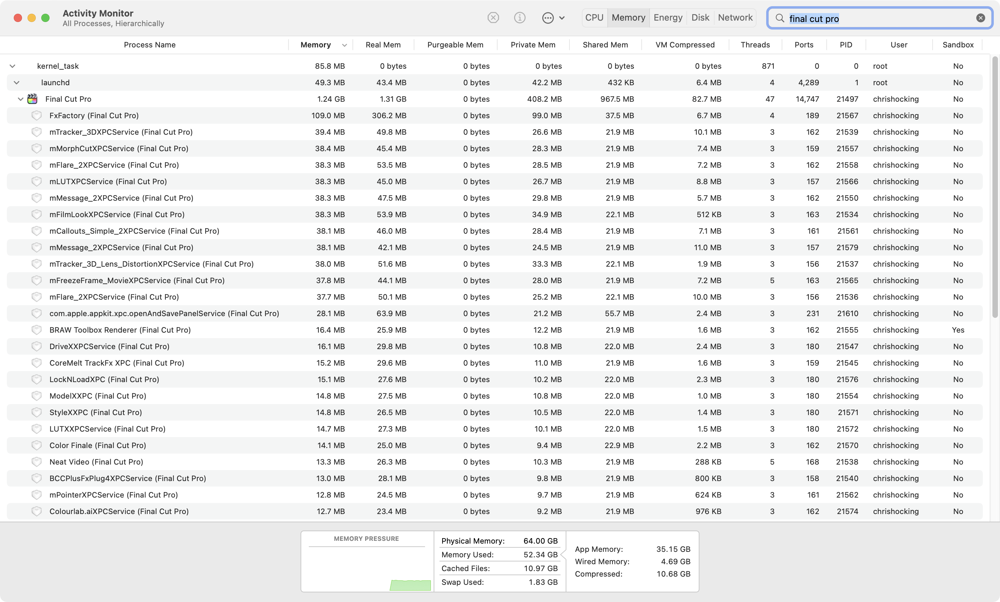

# Bug Tracker

This page is dedicated to keeping track of the latest Final Cut Pro bugs and issues.

!!!danger
**Final Cut Pro 10.6.7** has been released, and whilst there have been some users that have reported zero issues, there's many professionals that are reporting lots of unexpected bugs and crashes.

**Dylan Bates - The Final Cut Bro** has posted a [video here](https://www.youtube.com/watch?v=QiiasioJQ5Q) explaining.

There currently doesn't seem to be any common thread - people on Apple Silicon, Intel, Monterey, Ventura, etc. are all reporting different problems across all areas of the application - from Viewer going black to full system shutdowns.

For now, I would strongly suggest you stick with **Final Cut Pro 10.6.5** or **Final Cut Pro 10.6.6** until Apple resolves these issues in a future update.

We are keeping track of the bug reports [in this thread](https://github.com/CommandPost/FCPCafe/issues/223), in our Bug Tracker. We've reported several bugs directly to Apple.

I've personally been pushing **Final Cut Pro 10.6.7** pretty hard since it's release on a new, big and complex timeline, with heaps of Motion Templates, effects, stills and random footage. I've had to restart it a few times due to the Viewer going black, or strobing, and so far I've had one crash.

Additionally, **Final Cut Pro 10.6.7 (for Mac)** uses a newer Library format than **Final Cut Pro 1.1 (for iPad)**.

This means that if you want to use [Transfer Toolbox](https://transfertoolbox.io){target="_blank"} to go from Mac to iPad, you should keep using **Final Cut Pro 10.6.6 (for Mac)**.

_**Last Updated:** 26th July 2023_
!!!

We keep track of these bugs via our [GitHub issues site](https://github.com/CommandPost/FCPCafe/issues){target="_blank"}.

[GitHub](https://github.com){target="_blank"} is a **safe and secure** developers platform used by **over 73 million users** worldwide.

To submit a new bug report, simply sign up for a free GitHub account and post an issue [here](https://github.com/CommandPost/FCPCafe/issues/new?assignees=&labels=&projects=&template=bug-report.md&title=){target="_blank"}.

If you'd prefer not to use GitHub, then you can always email us your bug report: [support@latenitefilms.com](mailto:support@latenitefilms.com)

Whenever posting a new bug/issue to GitHub, we also submit feedback directly to Apple via [Feedback Assistant](https://feedbackassistant.apple.com){target="_blank"}.

You can also send feedback directly to the Final Cut Pro team via their [Feedback Form](https://www.apple.com/feedback/finalcutpro/){target="_blank"}, however, unlike Feedback Assistant you can't track your request or add additional information after submitting, nor can you have a discussion with the Apple team via the comments - so we generally recommend you use Feedback Assistant as well.

---

### Finding Crash Logs

You can find previous crash logs in this folder:

`~/Library/Logs/DiagnosticReports/`

You can find your user library by holding down `OPTION` when you click the `Go` menubar item from Finder.

Because crash logs are really large, the easiest way to share them on GitHub (and with Apple via feedback) is via a [GitHub Gist](https://gist.github.com).

---

### Third Party Software

It's important to note that since **Final Cut Pro 10.6.6** Apple has dropped **FxPlug3** support.

When the effect or look you want to achieve can't be created with the filters or generators provided with Final Cut Pro or Motion, the FxPlug software development kit (SDK) allows you to write your own custom visual effects.

FxPlug is a compact, powerful image-processing plug-in architecture that lets you create unique, hardware-accelerated or CPU-based effects plug-ins with customized UI and onscreen controls.

In **Final Cut Pro 10.6.5** and earlier, **FxPlug3** plugins ran "inside" Final Cut Pro, and a bad plugin could crash Final Cut Pro.

However, since **Final Cut Pro 10.6.6**, only **FxPlug4** is supported, and all FxPlug4 plugins are run "out of process" - meaning they're effectively their own application, and if they crash, Final Cut Pro doesn't.

Generally speaking if a FxPlug4 plugin crashes, then Final Cut Pro will just try restart it, and if it crashes 5 times or so, then it'll display the "this plugin is not responding" message.

All **Workflow Extensions** also run out of process.

For example, you can see all the different processes in Activity Monitor:

If you manually try and force quit a process, you'll see Final Cut Pro start it up again when needed.

What this means is that since **Final Cut Pro 10.6.6**, if Final Cut Pro crashes, it's NOT a third party FxPlug4 effect or a Workflow Extension - it's something in Apple's own code, and there's nothing third party developers can do about it, so there's no point emailing FxFactory, CoreMelt, MotionVFX, etc. to complain.

---

!!!success Want to add something to the Bug Tracker?
Create a free GitHub account then [click here](https://github.com/CommandPost/FCPCafe/issues/new?assignees=&labels=&projects=&template=bug-report.md&title=){target="_blank"}!
!!!

---

### Final Cut Pro 10.6.7

Here's a list of the **30 most recently added** Final Cut Pro 10.6.7 bug reports:

{{ include "bugtracker-latest" }}

The above list is pulled from our [GitHub issues site](https://github.com/CommandPost/FCPCafe/issues){target="_blank"}.

---

### Final Cut Pro 10.6.6

Here's a list of the **30 most recently added** Final Cut Pro 10.6.6 bug reports.

These bugs will eventually be migration to the 10.6.7 list once confirmed.

{{ include "bugtracker-previous" }}

The above list is pulled from our [GitHub issues site](https://github.com/CommandPost/FCPCafe/issues){target="_blank"}.

---

### Most Popular

Here's a list of the **30 most popular** Final Cut Pro bug reports:

{{ include "bugtracker-reactions" }}

The above list is pulled from our [GitHub issues site](https://github.com/CommandPost/FCPCafe/issues){target="_blank"}.

---

### Recently Added

Here's a list of the **30 most recently added** Final Cut Pro bug reports:

{{ include "bugtracker-recent" }}

The above list is pulled from our [GitHub issues site](https://github.com/CommandPost/FCPCafe/issues){target="_blank"}.

---

!!!
Want to contribute? [Learn more here!](/contribute/)
!!!