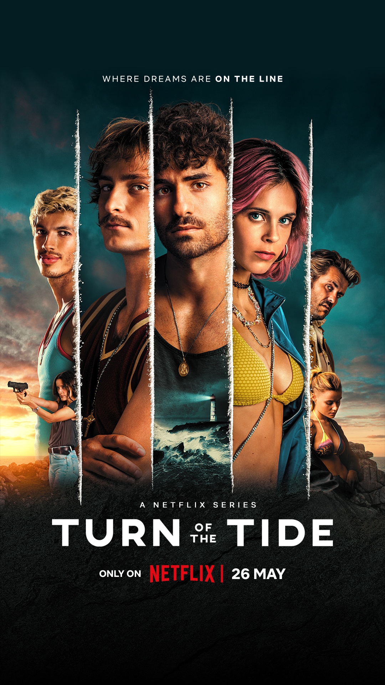

# Turn of the Tide

**Turn of the Tide** premieres today on Netflix. Fully edited in Final Cut Pro.

Created by Augusto de Fraga. Edited by Marcos Castiel (Ep's 1, 2, 5 & 7) and Pedro Ribeiro (Ep's 3, 4 & 6).

    <iframe class="video" src="https://www.youtube-nocookie.com/embed/_tHdyD9TGCA?controls=0" title="YouTube video player" frameborder="0" allow="accelerometer; autoplay; clipboard-write; encrypted-media; gyroscope; picture-in-picture; web-share" allowfullscreen></iframe>

We will be adding a full case study in the coming weeks.

