# Turn of the Tide

**Turn of the Tide** premiered on Netflix on Friday 26th May 2023. Fully edited in Final Cut Pro.

Created by Augusto de Fraga. Edited by Marcos Castiel (Ep's 1, 2, 5 & 7) and Pedro Ribeiro (Ep's 3, 4 & 6).

---

### Notes from the Editor

The English title of the upcoming series, "Turn of the Tide", holds a deeper meaning for me.

Although I have been using Final Cut Pro (FCP) since 2019, it was only reserved for commercials.

However, when I was asked to edit Netflix's "Gloria", I opted for Premiere instead, due to the post-production house's lack of experience with FCP.

The same issue arose when I edited the feature film "Remains of the Wind," which was also done in Premiere.

Fast forward to 2022, and I was invited by the creator and showrunner of "Turn of the Tide", Augusto de Fraga, to edit the series. I said straight away I was going to edit this on FCP. Augusto told me, "I don't really care what you use to edit. That's your thing. Run with it".

"Turn of the Tide" was a turning point in my editing career, allowing me to use my favourite NLE for fiction.

Originally, the plan was for me to edit all seven episodes, but time constraints meant I had to share my workload with another editor, Pedro Ribeiro.

Pedro is an avid user and veteran editor, so I had to break the news to him that, for this one, he was using FCP. Pedro spent two weeks learning the software, and that was it.

The production company initially resisted the idea of using FCP, and I vented my frustration to fellow editors about the lack of trust in FCP for major projects.

As a group, we even wrote an [open letter](/openletter/) to Apple addressing the issues we sometimes face trying to convince producers to let us edit on FCP.

The production company asked for a workflow test, which I confidently agreed to.

To prepare, I read Knut and Sam's [Notion Workflow Guide for FCP on feature and episodic TV](/workflow/#final-cut-pro-workflow-for-feature-films), which I highly recommend to anyone using FCP for fiction.

I also called the color grading and sound studios to talk about validating my XMLs and AAFs. That workflow test went seamlessly.

The editorial collaboration was made possible by [PostLab](/tools/#postlab), a third-party software tool since FCP does not have native collaboration built-in.

We used shared storage and edited seamlessly without technical hiccups.

FCP is so fast that we spent more time focusing on the creative aspect of editing and not on the technical ones.

Our 1st assistant, Maria Ruiz, smoothly handled VFX turnovers and color using FCP's native XML.

For sound turnovers, she used [X2Pro](/tools/#x2pro) to create AAFs, which our sound team praised. Our AAFs were very well organized. We can thank FCP roles feature for that.

Color was done in Resolve, sound in ProTools.

I wish this case study could be longer, but the editorial process was so smooth that I really don't have much to say.

_Marcos Castiel (Ep's 1, 2, 5 & 7)_

---

### Trailer

{target="_blank"}

---

### Poster

---

### Screenshots

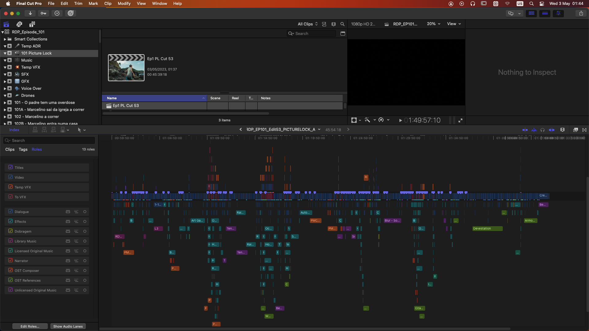

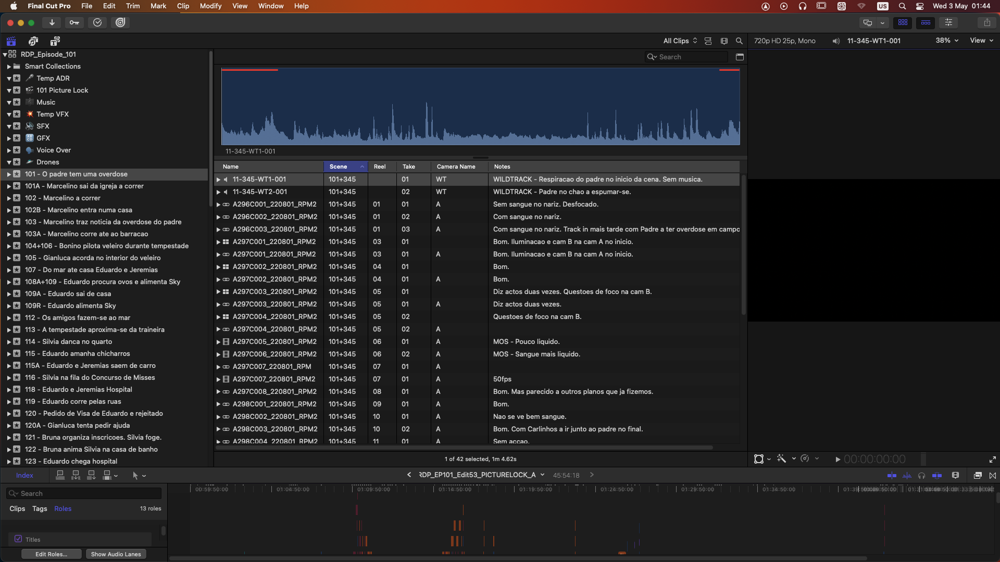

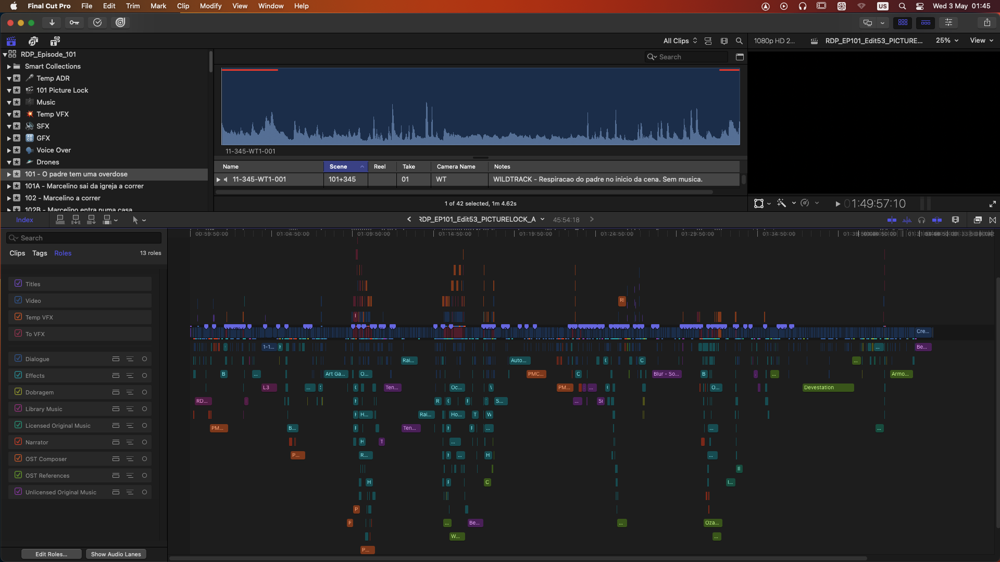

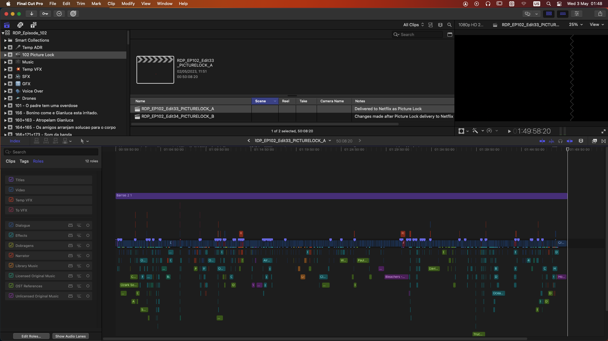

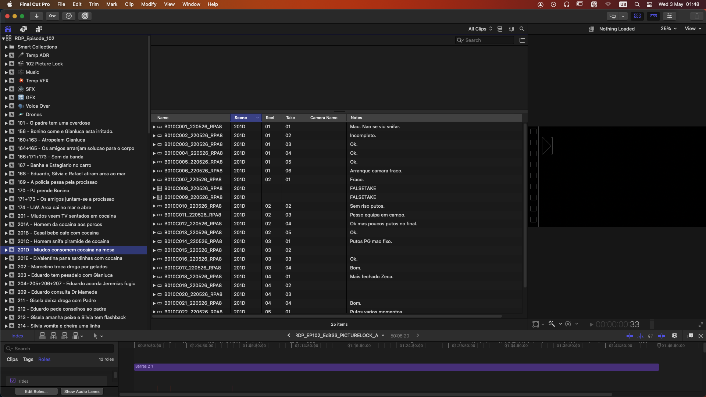

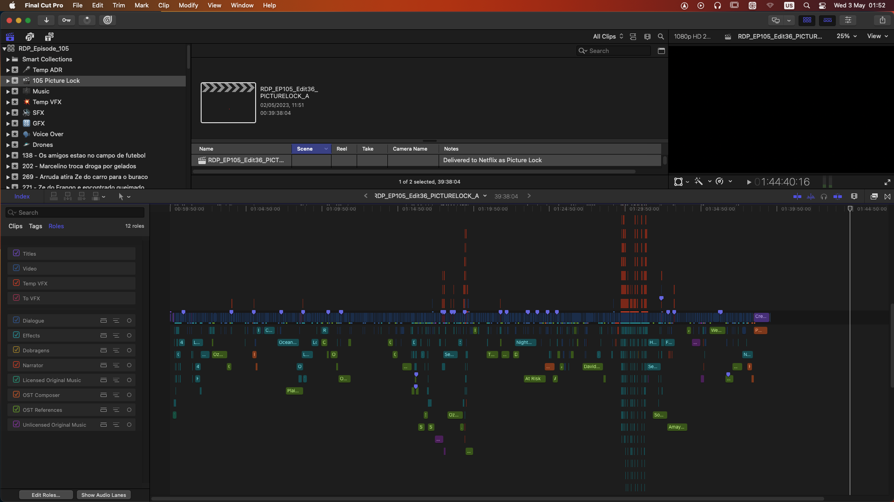

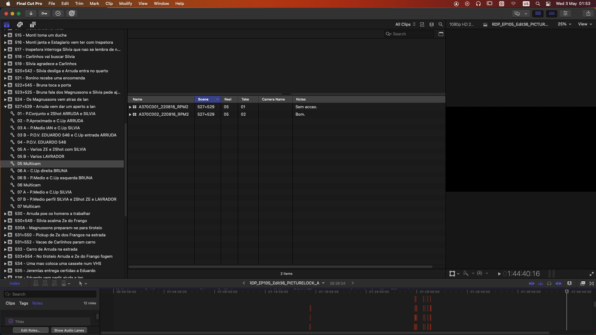

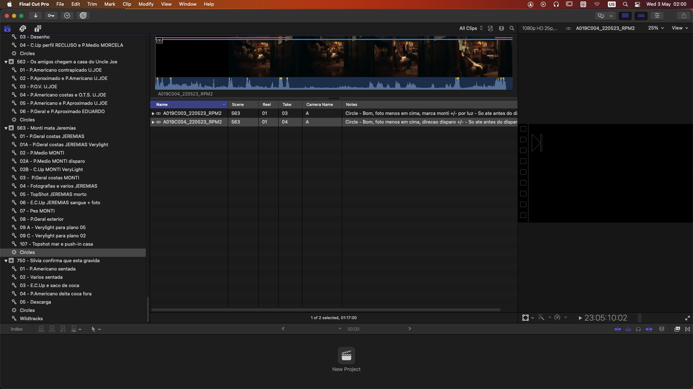

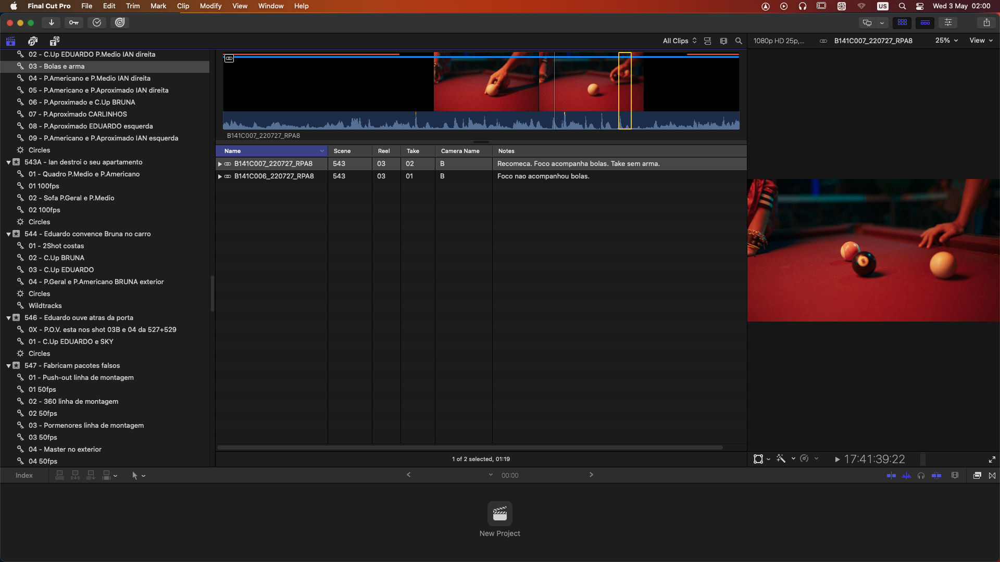

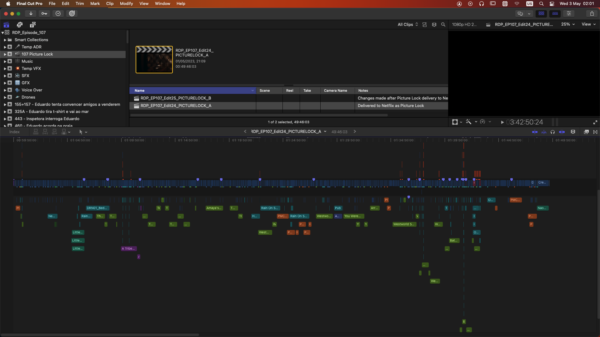

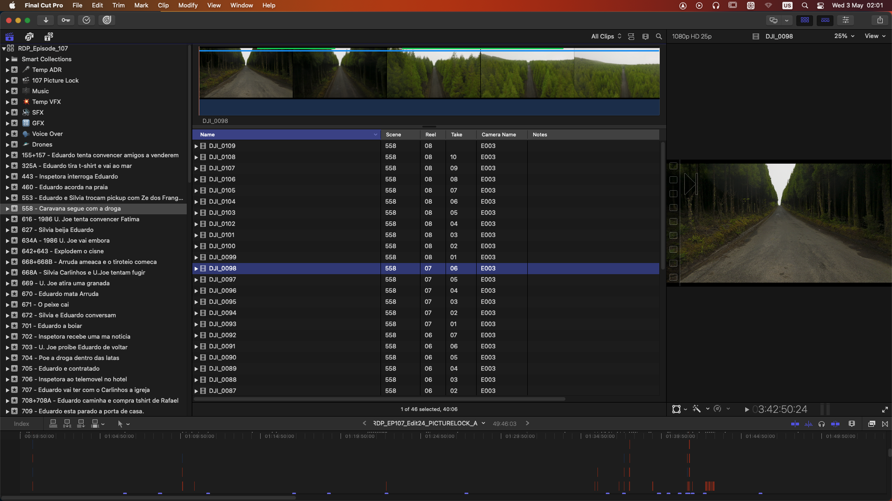

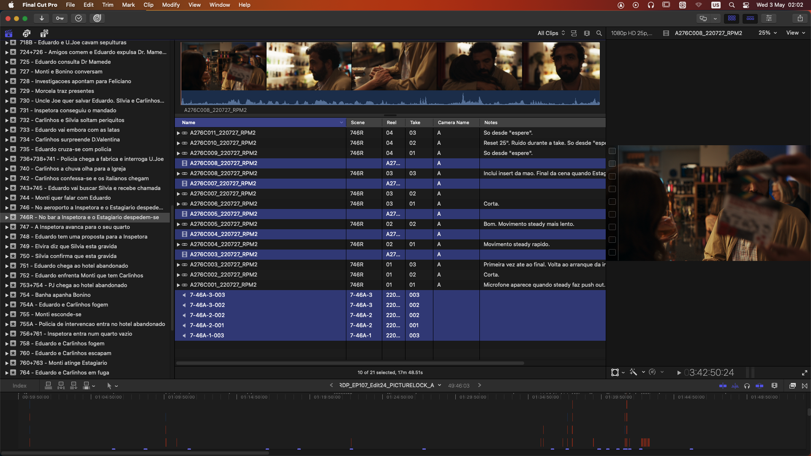

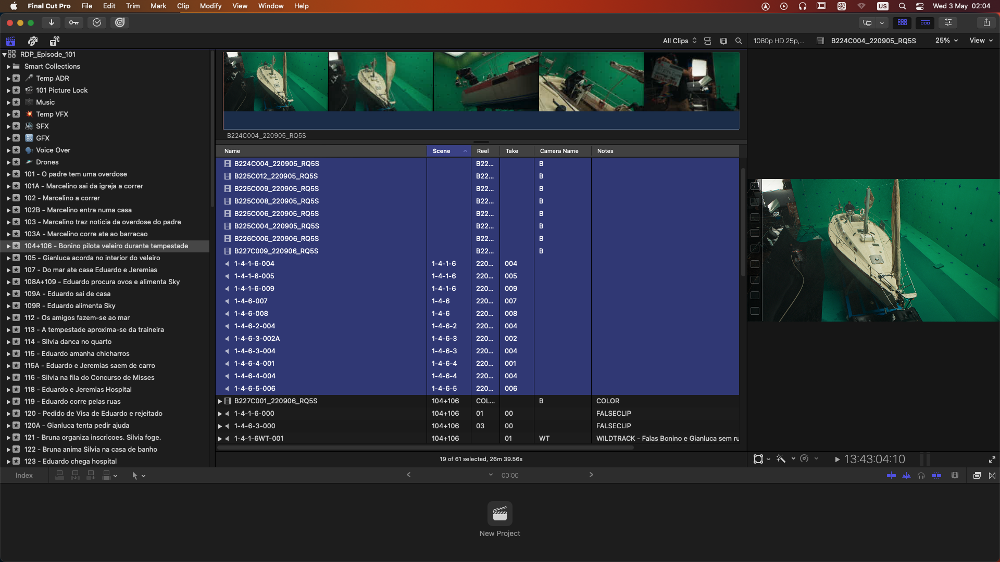

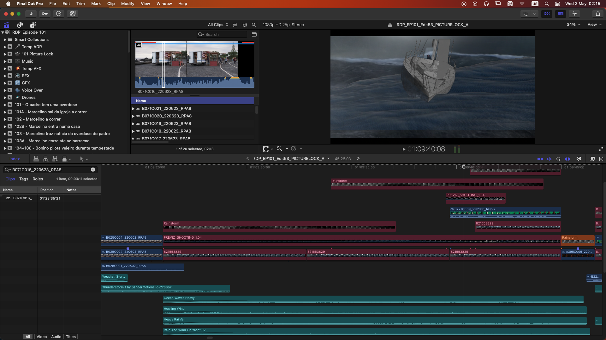

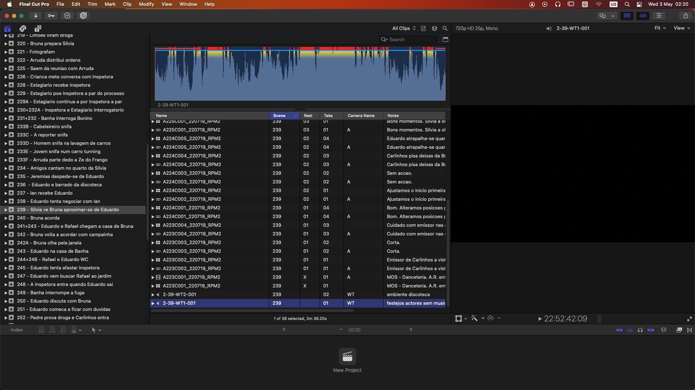

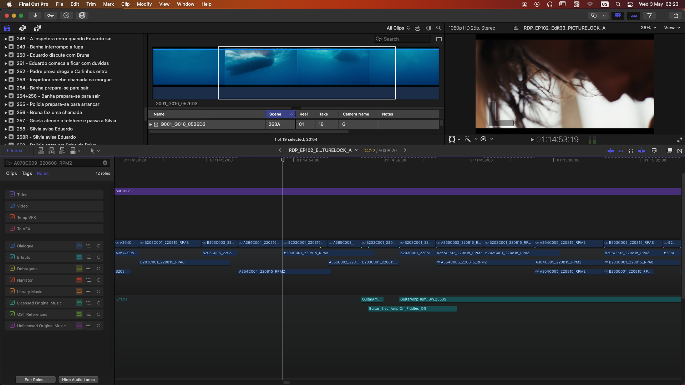

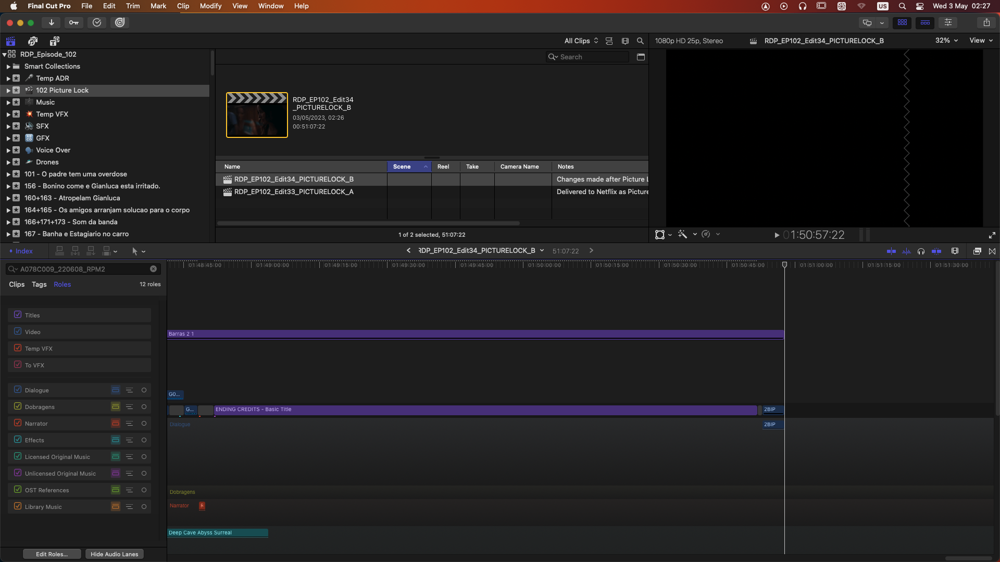

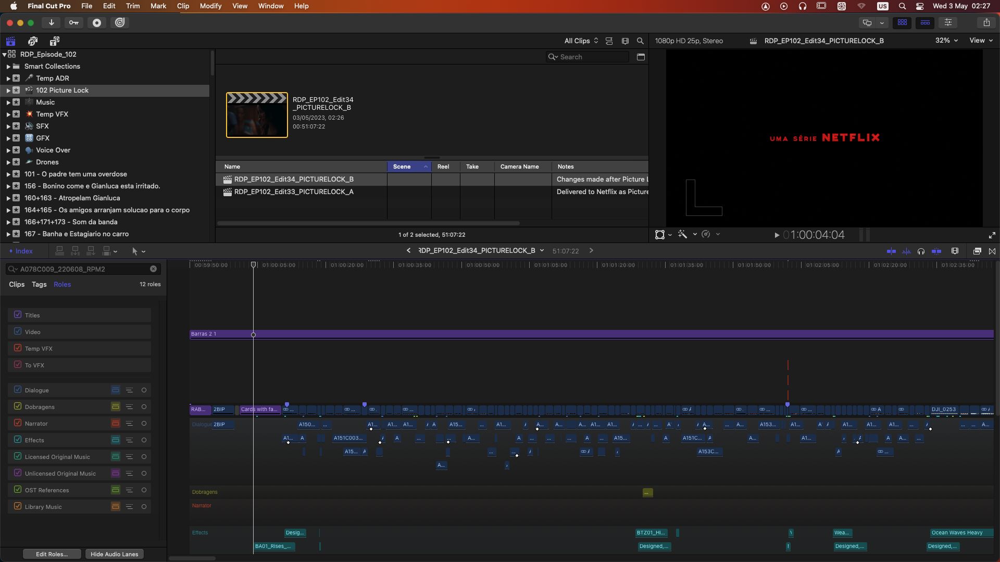
