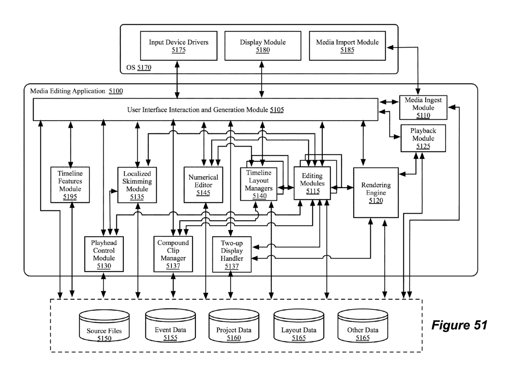

# Patents

To get an overview of how Final Cut Pro works, it's worth checking out the original parent as a [PDF with images](http://pimg-fpiw.uspto.gov/fdd/25/750/088/0.pdf){target="_blank"} or as [searchable plain text](http://patft.uspto.gov/netacgi/nph-Parser?Sect1=PTO1&Sect2=HITOFF&d=PALL&p=1&u=%2Fnetahtml%2FPTO%2Fsrchnum.htm&r=1&f=G&l=50&s1=8,875,025.PN.&OS=PN/8,875,025&RS=PN/8,875,025){target="_blank"}.

Here's one of the screenshots from the patent:

---

!!!
Want to contribute? [Learn more here!](https://fcp.cafe/contribute/){target="_blank"}
!!!

---

{{ include "giscus.md" }}