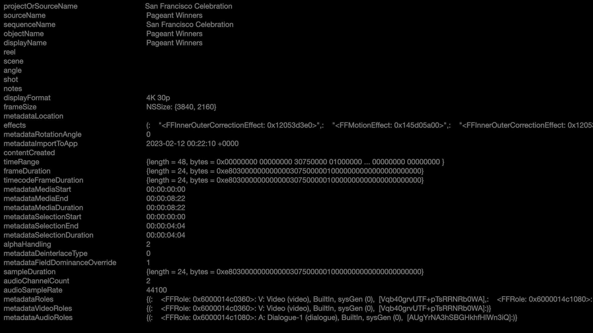

# Motion Variables

On this page is a list of text variables you can use in Apple's Motion to write metadata in Final Cut Pro.

This list was found by exploring the Motion binary using [Hopper](https://www.hopperapp.com){target="_blank"}.

You can also download an example Motion Template effect [here](https://github.com/CommandPost/FCPCafe/raw/main/downloads/clip-info.zip).

The output of the effect looks like this in Final Cut Pro 10.6.6 (created in Motion 5.6.4):

As you can see in the above screenshot, not all the metadata is showing - this is because some of it only works in Apple Motion.

It's also possible that things change between Final Cut Pro versions.

---

Token                                               | Description
---                                                 | ---
`@#$sourceObject_alphaHandling`                     | Alpha Handling
`@#$sourceObject_angle`                             | Angle
`@#$sourceObject_audioChannelCount`                 | Audio Channel Count
`@#$sourceObject_audioSampleRate`                   | Audio Sample Rate
`@#$sourceObject_contentCreated`                    | Content Created
`@#$sourceObject_displayFormat`                     | Display Format
`@#$sourceObject_displayName`                       | Display Name
`@#$sourceObject_effects`                           | Effects
`@#$sourceObject_frameDuration`                     | Frame Duration
`@#$sourceObject_frameSize`                         | Frame Size
`@#$sourceObject_metaData_reel`                     | **Source Reel Name**
`@#$sourceObject_metadataAudioRoles`                | Audio Roles Metadata
`@#$sourceObject_metadataDeinterlaceType`           | De-interlace Type
`@#$sourceObject_metadataFieldDominanceOverride`    | Field Dominance Override
`@#$sourceObject_metadataImportToApp`               | Import to App
`@#$sourceObject_metadataLocation`                  | Location
`@#$sourceObject_metadataMediaDuration`             | Media Duration
`@#$sourceObject_metadataMediaEnd`                  | Media End
`@#$sourceObject_metadataMediaStart`                | Media Start
`@#$sourceObject_metadataRoles`                     | Metadata Roles
`@#$sourceObject_metadataRotationAngle`             | Rotation Angle
`@#$sourceObject_metadataSelectionDuration`         | Selection Duration
`@#$sourceObject_metadataSelectionEnd`              | Selection End
`@#$sourceObject_metadataSelectionStart`            | Selection Start
`@#$sourceObject_metadataVideoRoles`                | Video Roles
`@#$sourceObject_notes`                             | Notes
`@#$sourceObject_objectName`                        | Object Name
`@#$sourceObject_projectOrSource`                   | **Source Clip Name** |
`@#$sourceObject_projectOrSourceName`               | Project or Source Name
`@#$sourceObject_reel`                              | Reel
`@#$sourceObject_sampleDuration`                    | Sample Duration
`@#$sourceObject_scene`                             | Scene
`@#$sourceObject_sequenceName`                      | Sequence Name
`@#$sourceObject_shot`                              | Shot
`@#$sourceObject_sourceName`                        | Source Name
`@#$sourceObject_timecodeFrameDuration`             | Timecode Frame Duration
`@#$sourceObject_timeRange`                         | Time Range

---

!!!
Want to update any of the above? [Learn more here!](https://fcp.cafe/contribute/){target="_blank"}
!!!

---

{{ include "giscus.md" }}