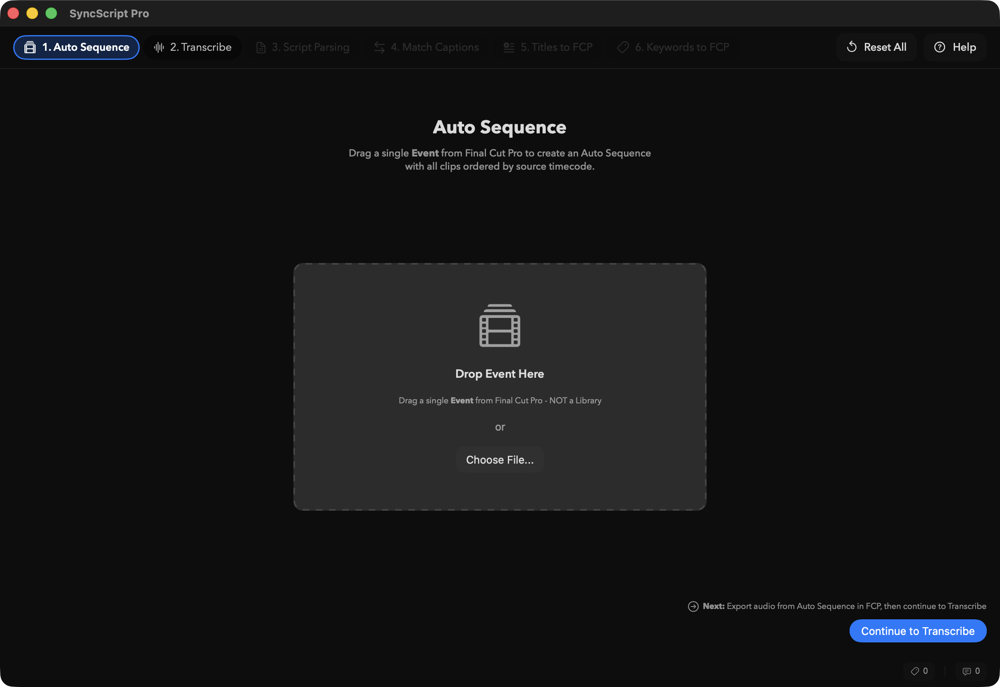
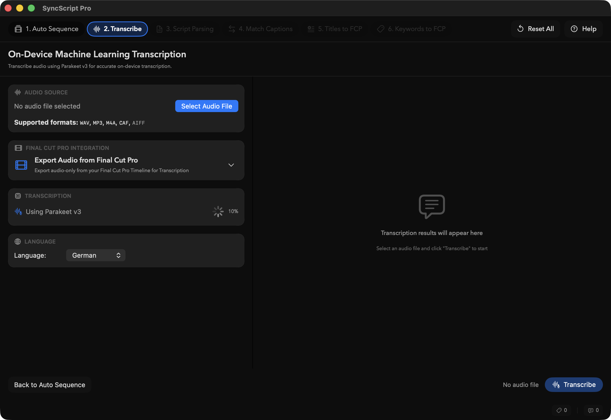

It's beta day, and we need your help!

**SyncScript Pro v1.0.0 (Build 6)** is out now on **TestFlight**, and we'd LOVE your feedback!

**SyncScript Pro** allows you to synchronise Script Keywords with transcribed Captions and generate `FCPXML` Titles for Final Cut Pro.

You can learn more and download on the [SyncScript Pro website](https://syncscriptpro.fcp.cafe/).