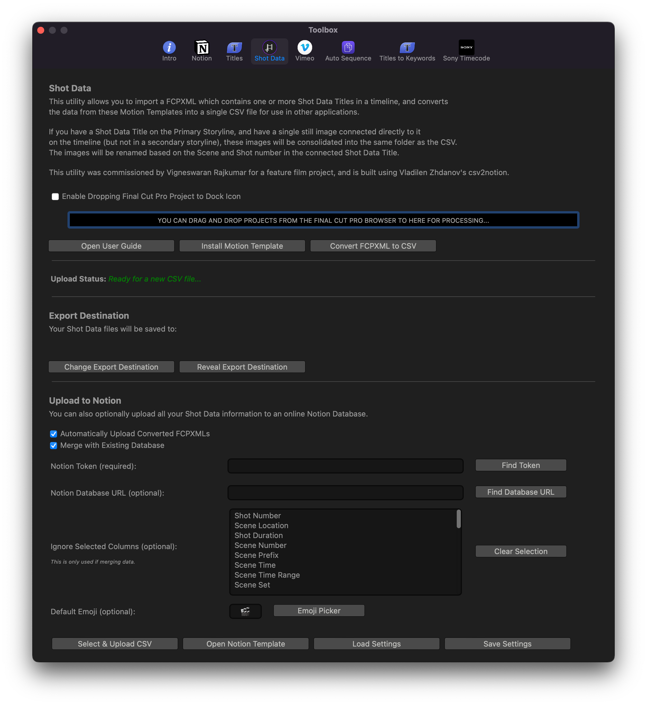

# Workflow

This page will be dedicated to professional Final Cut Pro Workflows.

---

### Final Cut Pro Workflow for Feature Films

Feature film editor [Knut Hake](http://www.knuthake.de){target="_blank"} has created an entire Notion page dedicated to Final Cut Pro Workflows for feature films.

[!button text="Open Notion Site" target="blank" variant="info"](https://knuthake.notion.site/Final-Cut-Pro-Workflow-for-feature-films-8ba47cb0860049eebca48e4317ba2c09)

---

### Shot Data

[Vigneswaran Rajkumar](https://twitter.com/IAmVigneswaran){target="_blank"} has developed a unique workflow with [Chris Hocking](https://twitter.com/chrisatlatenite){target="_blank"} for filmmakers. The workflow uses CommandPost’s Shot Data Toolbox to create a Shot List & Storyboard Database from Final Cut Pro to Notion.

[!button text="Open User Guide" target="blank" variant="info"](https://help.commandpost.io/toolbox/shot_data)

---

{{ include "contribute-learn-more.md" }}

---

{{ include "giscus.md" }}